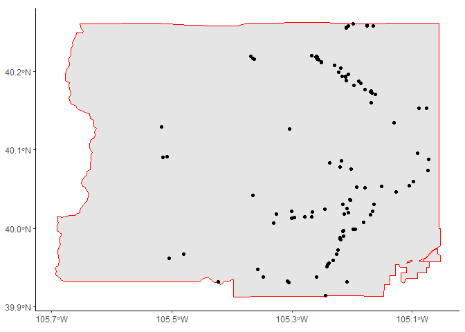
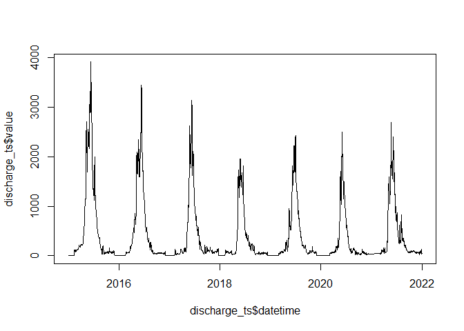
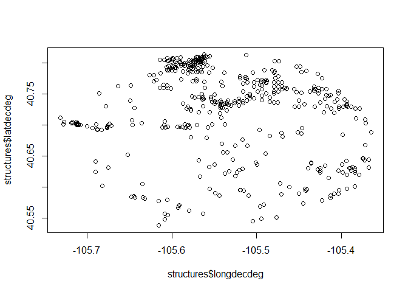
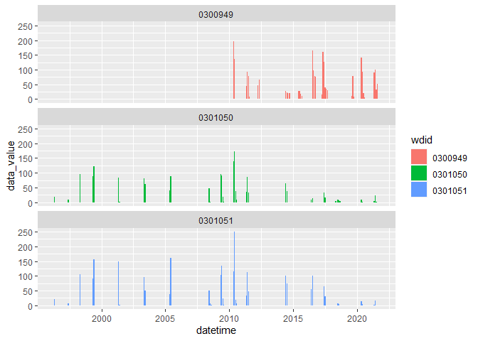
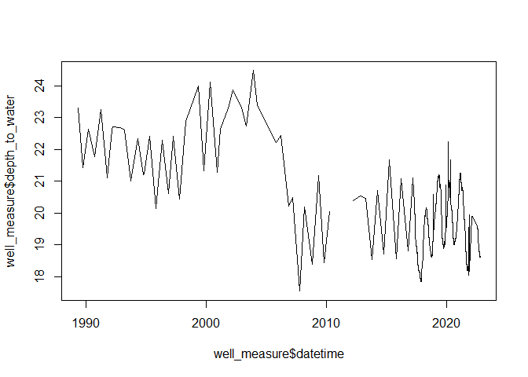

<!-- README.md is generated from README.Rmd. Please edit that file -->

# **cdssr** 

<!-- badges: start -->

[](#)
[](https://choosealicense.com/licenses/mit/)
<!-- badges: end -->

<div align="left">

<p align="left">
<a href="https://dwr.state.co.us/Tools"><strong>« CDSS »</strong></a>
<br /> <a href="https://dwr.state.co.us/Rest/GET/Help">CDSS REST Web
Services</a>
</p>

</div>

<hr>

The goal of **`cdssr`** is to provide functions that help R users to
navigate, explore, and make requests to the [CDSS REST API web
service](https://dwr.state.co.us/Rest/GET/Help).

The Colorado’s Decision Support Systems (CDSS) is a water management
system created and developed by the [Colorado Water Conservation Board
(CWCB)](https://cwcb.colorado.gov/) and the [Colorado Division of Water
Resources (DWR)](https://dwr.colorado.gov/).

Thank you to those at CWCB and DWR for providing an accessible and well
documented REST API!

<hr>

## Installation

You can install the development version of **`cdssr`** from
[GitHub](https://github.com/) with:

``` r
# install.packages("devtools")
devtools::install_github("anguswg-ucsb/cdssr")
```

``` r
# Load package
library(cdssr)
```

## **Available endpoints**

Below is a table of all of the CDSS API endpoints **`cdssr`** has
functions for.

| **-** | **Function**                    | **Description**                                                    | **Endpoint**                                                                                                                                                                                                                         |
|-------|---------------------------------|--------------------------------------------------------------------|--------------------------------------------------------------------------------------------------------------------------------------------------------------------------------------------------------------------------------------|
| 1     | **get_admin_calls()**           | Returns list of active/historic administrative calls               | [administrativecalls/active](https://dwr.state.co.us/rest/get/help#Datasets&#AdministrativeCallsController&https://dnrweblink.state.co.us/dwr/ElectronicFile.aspx?docid=3600964&dbid=0&#gettingstarted&#jsonxml)                     |
| 2     | **get_structures()**            | Returns list of administrative structures                          | [structures](https://dwr.state.co.us/rest/get/help#Datasets&#StructuresController&#gettingstarted&#jsonxml)                                                                                                                          |
| 3     | **get_structures_divrec()**     | Returns list of diversion/release/stage records based on WDID      | [structures/divrec/](https://dwr.state.co.us/rest/get/help#Datasets&#DiversionRecordsController&https://dnrweblink.state.co.us/dwr/ElectronicFile.aspx?docid=3600965&dbid=0&#gettingstarted&#jsonxml)                                |
| 4     | **get_climate_stations()**      | Returns Climate Stations                                           | [climatedata/climatestations](https://dwr.state.co.us/rest/get/help#Datasets&#ClimateStationsController&https://www.ncdc.noaa.gov/cdo-web/webservices&https://www.northernwater.org/our-data/weather-data&#gettingstarted&#jsonxml)  |
| 5     | **get_climate_ts()**            | Returns Climate Station Time Series (day, month, year)             | [climatedata/climatestationts](https://dwr.state.co.us/rest/get/help#Datasets&#ClimateStationsController&https://www.ncdc.noaa.gov/cdo-web/webservices&https://www.northernwater.org/our-data/weather-data&#gettingstarted&#jsonxml) |
| 6     | **get_gw_gplogs_wells()**       | Returns Groundwater GeophysicalLogsWell from filters               | [groundwater/geophysicallogs/](https://dwr.state.co.us/rest/get/help#Datasets&#GroundwaterGeophysicalLogsController&#gettingstarted&#jsonxml)                                                                                        |
| 7     | **get_gw_gplogs_geologpicks()** | Returns Groundwater Geophysical Log picks by well ID               | [groundwater/geophysicallogs/](https://dwr.state.co.us/rest/get/help#Datasets&#GroundwaterGeophysicalLogsController&#gettingstarted&#jsonxml)                                                                                        |
| 7     | **get_gw_wl_wells()**           | Returns WaterLevelsWell from filters                               | [groundwater/waterlevels/wells](https://dwr.state.co.us/rest/get/help#Datasets&#GroundwaterLevelsController&#gettingstarted&#jsonxml)                                                                                                |
| 6     | **get_gw_wl_wellmeasures()**    | Returns Groundwater Measurements                                   | [groundwater/waterlevels/wellmeasurements](https://dwr.state.co.us/rest/get/help#Datasets&#GroundwaterLevelsController&#gettingstarted&#jsonxml)                                                                                     |
| 8     | **get_reference_tbl()**         | Returns reference tables list                                      | [referencetables/](https://dwr.state.co.us/rest/get/help#Datasets&#ReferenceTablesController&#gettingstarted&#jsonxml)                                                                                                               |
| 9     | **get_sw_stations()**           | Returns Surface Water Station info                                 | [surfacewater/surfacewaterstations](https://dwr.state.co.us/rest/get/help#Datasets&#SurfaceWaterController&#gettingstarted&#jsonxml)                                                                                                 |
| 10    | **get_sw_ts()**                 | Returns Surface Water Time Series                                  | [surfacewater/surfacewaterts](https://dwr.state.co.us/rest/get/help#Datasets&#SurfaceWaterController&#gettingstarted&#jsonxml)                                                                                                       |
| 11    | **get_telemetry_stations()**    | Returns telemetry stations and their most recent parameter reading | [telemetrystations/telemetrystation](https://dwr.state.co.us/rest/get/help#Datasets&#TelemetryStationsController&#gettingstarted&#jsonxml)                                                                                           |
| 12    | **get_telemetry_ts()**          | Returns telemetry time series data (raw, hour, day)                | [telemetrystations/telemetrytimeseries](https://dwr.state.co.us/rest/get/help#Datasets&#TelemetryStationsController&#gettingstarted&#jsonxml)                                                                                        |

<br>

**Note:** Not all of the CDSS API endpoints have function in
**`cdssr`**(yet), but if you want to *quickly view all* of the possible
endpoints that the [CDSS REST API
provides](https://dwr.state.co.us/Rest/GET/Help) use the
**`browse_api()`** function.

#### View the return fields

Use **`preview_endpoint()`** to inspect what fields will be returned
from a given endpoint, enter the [help page
URL](https://dwr.state.co.us/Rest/GET/Help/Api/GET-api-v2-referencetables-stationflags).
This URL is also located as a column named **endpoint_url** in the data
frame output of **`browse_api()`**.

Let’s see what data will be returned from the
referencetables/stationflags/ endpoint

``` r
# URL to referencetables/stationflags endpoint
url <- 
  cdssr::browse_api() %>% 
  dplyr::filter(endpoint == "api/v2/referencetables/stationflags") %>% 
  .$endpoint_url

# Return expected data fields for a given endpoint
return_fields <- cdssr::preview_endpoint(
                      endpoint_url = url
                      )
```

    #> # A tibble: 4 × 3
    #>   name        description                     type  
    #>   <chr>       <chr>                           <chr> 
    #> 1 dataSource  Data Source that uses this flag string
    #> 2 description Description of the flag         string
    #> 3 flag        Short code for the flag         string
    #> 4 flagColumn  Column for this flag            string

<br> <br> <br>

## **Example: Telemetry site data**

#### Identify query inputs using reference tables

The **`get_reference_tbl()`** function will return tables that makes it
easier to know what information should be supplied to the data retrieval
functions in **`cdssr`**. For more information on the exact reference
tables click
[here](https://dwr.state.co.us/rest/get/help#Datasets&#ReferenceTablesController&#gettingstarted&#jsonxml).

Let’s locate the parameters available at telemetry stations.

``` r
# available parameters for telemetry stations
telemetry_params <- cdssr::get_reference_tbl(
  table_name = "telemetryparams"
  )
#> Retrieving telemetry parameter reference table from CDSS API...
```

    #> # A tibble: 46 × 1
    #>    parameter
    #>    <chr>    
    #>  1 AIRTEMP  
    #>  2 BAR_P    
    #>  3 BATTERY  
    #>  4 COND     
    #>  5 D1       
    #>  6 D2       
    #>  7 DISCHRG  
    #>  8 DISCHRG1 
    #>  9 DISCHRG2 
    #> 10 DISCHRG3 
    #> # … with 36 more rows

<br>

#### Locate stations

We can use the **`get_<endpoint>_stations()`** functions to identify the
stations within a given spatial extent (point/polygon), water district,
division, or county. Station data can also be retrieved by providing a
specific station abbreviation, GNIS ID, USGS ID, or WDID.

``` r
# identify telemetry stations in water district 6
stations <- cdssr::get_telemetry_stations(
  water_district = 6
  )
#> Retrieving telemetry station data from CDSS API...
```

    #> # A tibble: 71 × 35
    #>    divis…¹ water…² county stati…³ data_…⁴ data_…⁵ water…⁶ gnis_id strea…⁷ abbrev
    #>      <int>   <int> <chr>  <chr>   <chr>   <chr>   <chr>   <chr>     <dbl> <chr> 
    #>  1       1       6 BOULD… "ANDER… DWR     Co. Di… BOULDE… 001783…   23.6  ANDDI…
    #>  2       1       6 BOULD… "ANDRE… DWR     Co. Di… SOUTH … 001809…    1.5  ANFDI…
    #>  3       1       6 BOULD… "BASEL… DWR     Co. Di… BOULDE… 001783…   19.2  BASOU…
    #>  4       1       6 BOULD… "BOULD… NCWCD   Northe… BOULDE… 001783…   15.5  BCSCB…
    #>  5       1       6 BOULD… "BOULD… DWR     Co. Di… BOULDE… 001783…   22.3  BLDLH…
    #>  6       1       6 BOULD… "BUTTE… DWR     Co. Di… BOULDE… 001783…   18.6  BMLDI…
    #>  7       1       6 BOULD… "BOULD… DWR     Co. Di… BOULDE… 001783…    9.52 BOC10…
    #>  8       1       6 BOULD… "MIDDL… DWR     Co. Di… MIDDLE… 001785…    5.92 BOCBB…
    #>  9       1       6 BOULD… "SOUTH… DWR     Co. Di… SOUTH … 001809…   16.5  BOCBG…
    #> 10       1       6 BOULD… "BOULD… DWR     Co. Di… BOULDE… 001783…   22.3  BOCBR…
    #> # … with 61 more rows, 25 more variables: usgs_station_id <chr>,
    #> #   station_status <chr>, station_type <chr>, structure_type <chr>,
    #> #   meas_date_time <dttm>, parameter <chr>, stage <dbl>, meas_value <dbl>,
    #> #   units <chr>, flag_a <chr>, flag_b <chr>, contr_area <dbl>,
    #> #   drain_area <dbl>, huc10 <chr>, utm_x <dbl>, utm_y <dbl>, latitude <dbl>,
    #> #   longitude <dbl>, location_accuracy <chr>, wdid <chr>, modified <chr>,
    #> #   more_information <chr>, station_por_start <dttm>, station_por_end <dttm>, …



<br>

#### Retrieve Telemetry station timeseries data

The functions ending with \*\*\_ts()\*\* map to the various timeseries
data endpoints from the CDSS API.

We can then take a station abbreviations from the
**`get_telemetry_stations()`** call, a parameter from the
**`get_reference_tbl()`** call, and use this information as inputs into
the **`get_telemetry_ts()`** function.

The function call below with return a daily discharge timeseries for the
ANDDITCO site between 2015-2022

``` r
# # Daily discharge at "ANDDITCO" telemetry station
discharge_ts <- cdssr::get_telemetry_ts(
                      abbrev              = stations$abbrev[1],
                      parameter           = telemetry_params$parameter[7],
                      start_date          = "2015-01-01",
                      end_date            = "2022-01-01",
                      timescale           = "day"
                               )
#> Downloading data from CDSS API...
#> Telemetry station abbreviation: ANDDITCO
#> Parameter: DISCHRG
#> Timescale: day
```

    #> # A tibble: 572 × 7
    #>    abbrev   parameter date               value unit  datetime            times…¹
    #>    <chr>    <chr>     <chr>              <dbl> <chr> <dttm>              <chr>  
    #>  1 ANDDITCO DISCHRG   2020-05-07 00:00:…  3.05 cfs   2020-05-07 00:00:00 day    
    #>  2 ANDDITCO DISCHRG   2020-05-08 00:00:…  3.04 cfs   2020-05-08 00:00:00 day    
    #>  3 ANDDITCO DISCHRG   2020-05-09 00:00:…  2.98 cfs   2020-05-09 00:00:00 day    
    #>  4 ANDDITCO DISCHRG   2020-05-10 00:00:…  2.95 cfs   2020-05-10 00:00:00 day    
    #>  5 ANDDITCO DISCHRG   2020-05-11 00:00:…  2.95 cfs   2020-05-11 00:00:00 day    
    #>  6 ANDDITCO DISCHRG   2020-05-12 00:00:…  2.95 cfs   2020-05-12 00:00:00 day    
    #>  7 ANDDITCO DISCHRG   2020-05-13 00:00:…  2.95 cfs   2020-05-13 00:00:00 day    
    #>  8 ANDDITCO DISCHRG   2020-05-14 00:00:…  2.95 cfs   2020-05-14 00:00:00 day    
    #>  9 ANDDITCO DISCHRG   2020-05-15 00:00:…  2.95 cfs   2020-05-15 00:00:00 day    
    #> 10 ANDDITCO DISCHRG   2020-05-16 00:00:…  2.95 cfs   2020-05-16 00:00:00 day    
    #> # … with 562 more rows, and abbreviated variable name ¹​timescale



<br> <br> <br>

## **Example: Spatial search**

#### Find structures/stations from coordinates

A spatial search for structures/stations can be made by supplying an SF
point/polygon to the **aoi** argument and a numeric value for the search
**radius** distance in miles.

``` r
library(sf)
#> Linking to GEOS 3.9.1, GDAL 3.4.3, PROJ 7.2.1; sf_use_s2() is TRUE

# create a spatial point
pt <- sf::st_as_sf(
            data.frame(
              lng = -105.549  ,
              lat = 40.672
            ),
            coords = c("lng", "lat"),
            crs = 4326
            )

# locate structures within 10 miles of point
structures <- cdssr::get_structures(
  aoi    = pt,
  radius = 10
  )
#> Retreiving administrative structures from CDSS API...
#> Location search: 
#> Latitude: 40.672
#> Longitude: -105.549
#> Radius (miles): 10
```

    #> # A tibble: 528 × 37
    #>    wdid  struc…¹ assoc…² ciu_c…³ struc…⁴ water…⁵ gnis_id strea…⁶ assoc…⁷ assoc…⁸
    #>    <chr> <chr>   <chr>   <chr>   <chr>   <chr>   <chr>     <dbl> <chr>   <chr>  
    #>  1 0300… POUDRE… <NA>    U       DITCH   CACHE … 002050…   96.6  04CW03… <NA>   
    #>  2 0300… POUDRE… <NA>    U       DITCH   CACHE … 002050…   96.6  04CW03… <NA>   
    #>  3 0300… MUCKLO… <NA>    U       PIPELI… FALL C… 001773…    0.45 95CW02… <NA>   
    #>  4 0300… BRINKH… <NA>    U       PIPELI… MANHAT… 001771…    3.69 88CW00… <NA>   
    #>  5 0300… NORGRE… <NA>    U       SPRING  CACHE … 002050…   NA    W3906   <NA>   
    #>  6 0300… BEN DE… <NA>    U       DITCH   ELKHOR… 001702…    8.75 89CW02… <NA>   
    #>  7 0300… MANHAT… <NA>    U       DITCH   MANHAT… 001771…    1.48 89CW02… <NA>   
    #>  8 0300… FRY HA… <NA>    U       PUMP    CACHE … 002050…   89.5  97CW02… <NA>   
    #>  9 0300… HOME D… <NA>    U       DITCH   CACHE … 002050…   94.8  CA2031  <NA>   
    #> 10 0300… FRY HA… <NA>    A       DITCH   CACHE … 002050…   89.0  93CW00… <NA>   
    #> # … with 518 more rows, 27 more variables: associated_meters <lgl>,
    #> #   associated_contacts <chr>, por_start <chr>, por_end <chr>, division <int>,
    #> #   water_district <int>, subdistrict <lgl>, county <chr>,
    #> #   designated_basin_name <lgl>, management_district_name <lgl>, pm <chr>,
    #> #   township <chr>, range <chr>, section <chr>, q10 <chr>, q40 <chr>,
    #> #   q160 <chr>, coordsew <int>, coordsew_dir <chr>, coordsns <int>,
    #> #   coordsns_dir <chr>, utm_x <dbl>, utm_y <dbl>, latdecdeg <dbl>, …


<br>

#### Retrieve Diversion records for multiple structures

We can then use the WDID’s found from the spatial search to retrieve
diversion, release, stage, or volume data from multiple structures using
**`get_structures_divrec()`**.

**Note:** Data availability can vary between structures (i.e. Missing
data, not all structures have every data type/temporal resolution
available, etc.)

``` r
# create a character vector of WDID's for all active ditch structures
ditch_wdids <-
  structures %>%
    dplyr::filter(ciu_code == "A", structure_type == "DITCH") %>%
  .$wdid

# get diversion records
diversion_rec <-
  cdssr::get_structures_divrec(
                        wdid           = ditch_wdids,
                        wc_identifier  = "diversion",
                        type           = "month"
                        )
#> Retrieving monthly diversion data from CDSS API...
```

    #> # A tibble: 123 × 10
    #>    wdid    water_class…¹ wc_id…² meas_…³ data_…⁴ data_…⁵ meas_…⁶ obs_c…⁷ appro…⁸
    #>    <chr>           <int> <chr>   <chr>   <chr>     <dbl> <chr>   <chr>   <chr>  
    #>  1 0300949      10300949 030094… Daily   2010-05  195.   ACFT    *       Approv…
    #>  2 0300949      10300949 030094… Daily   2010-06  137.   ACFT    *       Approv…
    #>  3 0300949      10300949 030094… Daily   2010-07    0    ACFT    *       Approv…
    #>  4 0300949      10300949 030094… Daily   2011-05   43.6  ACFT    *       Approv…
    #>  5 0300949      10300949 030094… Daily   2011-06   93.2  ACFT    *       Approv…
    #>  6 0300949      10300949 030094… Daily   2011-07   77.4  ACFT    *       Approv…
    #>  7 0300949      10300949 030094… Daily   2011-08    8.93 ACFT    *       Approv…
    #>  8 0300949      10300949 030094… Daily   2012-04   46.6  ACFT    *       Approv…
    #>  9 0300949      10300949 030094… Daily   2012-05   66.4  ACFT    *       Approv…
    #> 10 0300949      10300949 030094… Daily   2014-06   28.3  ACFT    *       Approv…
    #> # … with 113 more rows, 1 more variable: datetime <date>, and abbreviated
    #> #   variable names ¹​water_class_num, ²​wc_identifier, ³​meas_interval,
    #> #   ⁴​data_meas_date, ⁵​data_value, ⁶​meas_units, ⁷​obs_code, ⁸​approval_status



<br> <br> <br>

## **Example: Groundwater well data**

#### Retrieve groundwater well data

The **get_gw\_()** set of functions lets users make get requests to the
various CDSS API groundwater endpoints shown in the table below:

Groundwater endpoints:

| **-** | **Function**                    | **Endpoint**                                                                                                                                     |
|-------|---------------------------------|--------------------------------------------------------------------------------------------------------------------------------------------------|
| 1     | **get_gw_wl_wellmeasures()**    | [api/v2/groundwater/waterlevels/wellmeasurements](https://dwr.state.co.us/Rest/GET/Help/Api/GET-api-v2-groundwater-waterlevels-wellmeasurements) |
| 2     | **get_gw_wl_wells()**           | [api/v2/groundwater/waterlevels/wells](https://dwr.state.co.us/Rest/GET/Help/Api/GET-api-v2-groundwater-waterlevels-wells)                       |
| 3     | **get_gw_gplogs_wells()**       | [api/v2/groundwater/geophysicallogs/wells](https://dwr.state.co.us/Rest/GET/Help/Api/GET-api-v2-groundwater-geophysicallogs-wells)               |
| 4     | **get_gw_gplogs_geologpicks()** | [api/v2/groundwater/geophysicallogs/geoplogpicks](https://dwr.state.co.us/Rest/GET/Help/Api/GET-api-v2-groundwater-geophysicallogs-geoplogpicks) |

<br>

Here we will retrieve groundwater well measurement data for Well ID 1274
between 1990-2022.

``` r
# Request wellmeasurements endpoint (api/v2/groundwater/waterlevels/wellmeasurements)
well_measure <- cdssr::get_gw_wl_wellmeasures(
  wellid     = 1274,
  start_date = "1990-01-01",
  end_date   = "2022-01-01"
  )
#> Downloading data from CDSS API...
#> Groundwater well measurements
```

    #> # A tibble: 1,469 × 18
    #>    well_id well_name      divis…¹ water…² county manag…³ desig…⁴ publi…⁵ measu…⁶
    #>      <int> <chr>            <int>   <int> <chr>  <lgl>   <lgl>   <chr>   <chr>  
    #>  1    1274 LSP-020  03N6…       1       2 WELD   NA      NA      LOWER … 1990-0…
    #>  2    1274 LSP-020  03N6…       1       2 WELD   NA      NA      LOWER … 1990-1…
    #>  3    1274 LSP-020  03N6…       1       2 WELD   NA      NA      LOWER … 1991-0…
    #>  4    1274 LSP-020  03N6…       1       2 WELD   NA      NA      LOWER … 1991-1…
    #>  5    1274 LSP-020  03N6…       1       2 WELD   NA      NA      LOWER … 1992-0…
    #>  6    1274 LSP-020  03N6…       1       2 WELD   NA      NA      LOWER … 1992-0…
    #>  7    1274 LSP-020  03N6…       1       2 WELD   NA      NA      LOWER … 1992-1…
    #>  8    1274 LSP-020  03N6…       1       2 WELD   NA      NA      LOWER … 1993-0…
    #>  9    1274 LSP-020  03N6…       1       2 WELD   NA      NA      LOWER … 1993-1…
    #> 10    1274 LSP-020  03N6…       1       2 WELD   NA      NA      LOWER … 1994-0…
    #> # … with 1,459 more rows, 9 more variables: depth_to_water <dbl>,
    #> #   measuring_point_above_land_surface <dbl>,
    #> #   depth_water_below_land_surface <dbl>, elevation_of_water <dbl>,
    #> #   delta <dbl>, data_source <chr>, published <chr>, modified <chr>,
    #> #   datetime <dttm>, and abbreviated variable names ¹​division, ²​water_district,
    #> #   ³​management_district, ⁴​designated_basin, ⁵​publication, ⁶​measurement_date



<br> <br>

> **More functions for more endpoints coming soon!**
