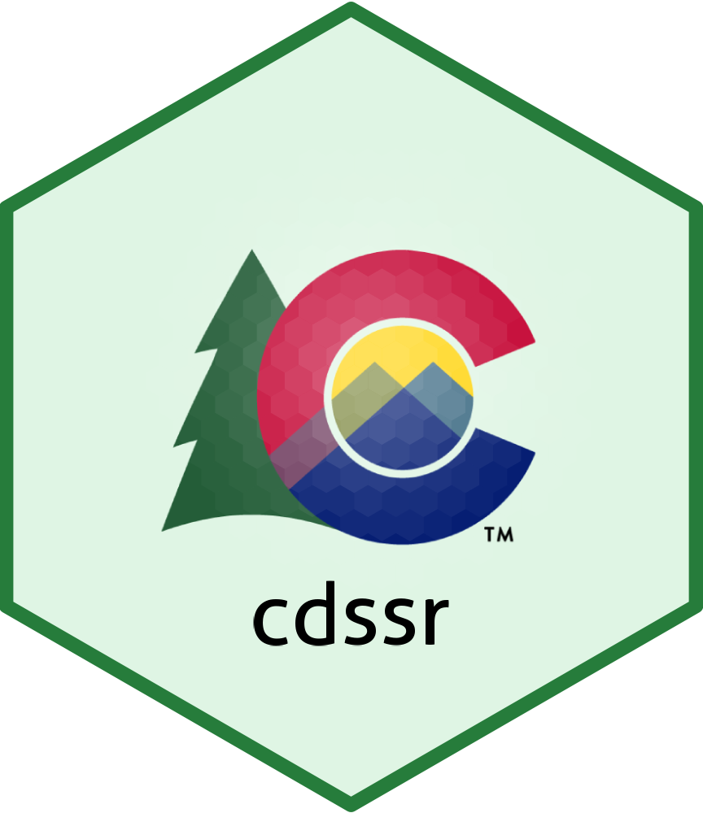

<!-- README.md is generated from README.Rmd. Please edit that file -->

# cdssr 

<!-- badges: start -->

[](#)
[](https://choosealicense.com/licenses/mit/)
<!-- badges: end -->

<div align="left">

<p align="left">
<a href="https://dwr.state.co.us/Tools"><strong>« CDSS »</strong></a>
<br /> <a href="https://dwr.state.co.us/Rest/GET/Help">CDSS API</a>
</p>

</div>

<hr>

The goal of `cdssr` is to provide functions that help R users to
navigate, explore, and make requests to the [CDSS REST API web
service](https://dwr.state.co.us/Rest/GET/Help).

The Colorado’s Decision Support Systems (CDSS) is a water management
system created and developed by the [Colorado Water Conservation Board
(CWCB)](https://cwcb.colorado.gov/) and the [Colorado Division of Water
Resources (DWR)](https://dwr.colorado.gov/).

Thank you to those at CWCB and DWR for providing an accessible and well
documented REST API!

<hr>

## Installation

You can install the development version of `cdssr` from
[GitHub](https://github.com/) with:

``` r
# install.packages("devtools")
devtools::install_github("anguswg-ucsb/cdssr")
```

## Browse avaliable endpoints

To browse all the available endpoints shown
[here](https://dwr.state.co.us/Rest/GET/Help) use `browse_api()`.

``` r
# Load package
library(cdssr)
```

``` r
# View the catalog of avaliable endpoints
catalog <- cdssr::browse_api()

catalog
#> # A tibble: 61 × 5
#>    resource                                      descrip…¹ endpo…² url   endpo…³
#>    <chr>                                         <chr>     <chr>   <chr> <chr>  
#>  1 Active Administrative Calls Generator         Returns … api/v2… http… https:…
#>  2 Historical Administrative Calls Generator     Returns … api/v2… http… https:…
#>  3 Water Source Route Analysis Info Generator    Returns … api/v2… http… https:…
#>  4 Water Source Route Framework Info Generator   Returns … api/v2… http… https:…
#>  5 Call Analysis Structure Info Generator        Performs… api/v2… http… https:…
#>  6 Call Analysis Stream Mile Info Generator      Performs… api/v2… http… https:…
#>  7 Climate Stations Generator                    Returns … api/v2… http… https:…
#>  8 Climate Station Data Types Generator          Returns … api/v2… http… https:…
#>  9 Climate Station Time Series - Day Generator   Returns … api/v2… http… https:…
#> 10 Climate Station Time Series - Month Generator Returns … api/v2… http… https:…
#> # … with 51 more rows, and abbreviated variable names ¹​description, ²​endpoint,
#> #   ³​endpoint_url
```

<br>

## View the return fields

Use `preview_endpoint()` Inspect what fields will be returned for a
given endpoint by entering a `endpoint_url` (a column in the
`browse_api()` output pointing to the endpoints help page)

``` r
# Return expected data fields for a given endpoint
return_fields <- cdssr::preview_endpoint(endpoint_url = catalog$endpoint_url[3])

return_fields
#> # A tibble: 6 × 3
#>   name          description                     type          
#>   <chr>         <chr>                           <chr>         
#> 1 featureType   Feature Type                    string        
#> 2 gnisId        GNIS ID                         string        
#> 3 streamMile    Stream Mile number              decimal number
#> 4 structureName Structure Name                  string        
#> 5 structureType Structure Type                  string        
#> 6 wdid          DWR unique structure identifier string
```

<br>

## Retrieve Telemetry station timeseries data

Use `get_` function to make requests to the CDSS API and return the
results in a tidy dataframe

``` r
# Daily discharge at "CLAFTCCO" telemetry station
discharge_ts <- cdssr::get_telemetry_ts(
                      abbrev              = "CLAFTCCO",
                      parameter           = "DISCHRG",
                      start_date          = "2015-01-01",
                      end_date            = "2022-01-01",
                      timescale           = "day",
                      include_third_party = TRUE
                               )
#> Downloading data from CDSS API...
#> Telemetry station abbreviation: CLAFTCCO
#> Parameter: DISCHRG
#> Timescale: day

head(discharge_ts, 10)
#>      abbrev parameter                date value unit   datetime timescale
#> 1  CLAFTCCO   DISCHRG 2015-01-01 00:00:00     0  cfs 2015-01-01       day
#> 2  CLAFTCCO   DISCHRG 2015-01-02 00:00:00     0  cfs 2015-01-02       day
#> 3  CLAFTCCO   DISCHRG 2015-01-03 00:00:00     0  cfs 2015-01-03       day
#> 4  CLAFTCCO   DISCHRG 2015-01-04 00:00:00     0  cfs 2015-01-04       day
#> 5  CLAFTCCO   DISCHRG 2015-01-05 00:00:00     0  cfs 2015-01-05       day
#> 6  CLAFTCCO   DISCHRG 2015-01-06 00:00:00     0  cfs 2015-01-06       day
#> 7  CLAFTCCO   DISCHRG 2015-01-07 00:00:00     0  cfs 2015-01-07       day
#> 8  CLAFTCCO   DISCHRG 2015-01-08 00:00:00     0  cfs 2015-01-08       day
#> 9  CLAFTCCO   DISCHRG 2015-01-09 00:00:00     0  cfs 2015-01-09       day
#> 10 CLAFTCCO   DISCHRG 2015-01-10 00:00:00     0  cfs 2015-01-10       day
#>    page_index source
#> 1           1   CDSS
#> 2           1   CDSS
#> 3           1   CDSS
#> 4           1   CDSS
#> 5           1   CDSS
#> 6           1   CDSS
#> 7           1   CDSS
#> 8           1   CDSS
#> 9           1   CDSS
#> 10          1   CDSS
```

And a plot of the daily discharge…

``` r
# Plot daily discharge at "CLAFTCCO"
plot(discharge_ts$value~discharge_ts$datetime, type = "l")
```


<br>

## Retrieve groundwater well data

The `get_groundwater()` function lets users make get requests to the
various CDSS API groundwater endpoints using the **type** parameter.

Groundwater endpoints:

-   [api/v2/groundwater/waterlevels/wellmeasurements](https://dwr.state.co.us/Rest/GET/Help/Api/GET-api-v2-groundwater-waterlevels-wellmeasurements)
-   [api/v2/groundwater/waterlevels/wells](https://dwr.state.co.us/Rest/GET/Help/Api/GET-api-v2-groundwater-waterlevels-wells)
-   [api/v2/groundwater/geophysicallogs/wells](https://dwr.state.co.us/Rest/GET/Help/Api/GET-api-v2-groundwater-geophysicallogs-wells)

``` r
# Use type = "wellmeasurements" to request wellmeasurements endpoint (api/v2/groundwater/waterlevels/wellmeasurements)
well_measure <- cdssr::get_groundwater(
  type    = "wellmeasurements",
  wellid  = 1274
  )
#> Downloading data from CDSS API...
#> Groundwater well measurements

head(well_measure, 10)
#>    well_id            well_name division water_district county
#> 1     1274 LSP-020  03N6618CAC2        1              2   WELD
#> 2     1274 LSP-020  03N6618CAC2        1              2   WELD
#> 3     1274 LSP-020  03N6618CAC2        1              2   WELD
#> 4     1274 LSP-020  03N6618CAC2        1              2   WELD
#> 5     1274 LSP-020  03N6618CAC2        1              2   WELD
#> 6     1274 LSP-020  03N6618CAC2        1              2   WELD
#> 7     1274 LSP-020  03N6618CAC2        1              2   WELD
#> 8     1274 LSP-020  03N6618CAC2        1              2   WELD
#> 9     1274 LSP-020  03N6618CAC2        1              2   WELD
#> 10    1274 LSP-020  03N6618CAC2        1              2   WELD
#>    management_district designated_basin                 publication
#> 1                   NA               NA LOWER SOUTH PLATTE ALLUVIUM
#> 2                   NA               NA LOWER SOUTH PLATTE ALLUVIUM
#> 3                   NA               NA LOWER SOUTH PLATTE ALLUVIUM
#> 4                   NA               NA LOWER SOUTH PLATTE ALLUVIUM
#> 5                   NA               NA LOWER SOUTH PLATTE ALLUVIUM
#> 6                   NA               NA LOWER SOUTH PLATTE ALLUVIUM
#> 7                   NA               NA LOWER SOUTH PLATTE ALLUVIUM
#> 8                   NA               NA LOWER SOUTH PLATTE ALLUVIUM
#> 9                   NA               NA LOWER SOUTH PLATTE ALLUVIUM
#> 10                  NA               NA LOWER SOUTH PLATTE ALLUVIUM
#>       measurement_date depth_to_water measuring_point_above_land_surface
#> 1  1989-05-11 00:00:00          23.30                                  0
#> 2  1989-10-16 00:00:00          21.43                                  0
#> 3  1990-03-26 00:00:00          22.64                                  0
#> 4  1990-10-10 00:00:00          21.77                                  0
#> 5  1991-04-01 00:00:00          23.25                                  0
#> 6  1991-10-18 00:00:00          21.10                                  0
#> 7  1992-03-16 00:00:00          22.62                                  0
#> 8  1992-03-23 00:00:00          22.71                                  0
#> 9  1992-11-17 00:00:00          22.69                                  0
#> 10 1993-03-16 00:00:00          22.62                                  0
#>    depth_water_below_land_surface elevation_of_water delta data_source
#> 1                           23.30            4786.06    NA         DWR
#> 2                           21.43            4787.93 -1.87         DWR
#> 3                           22.64            4786.72  1.21         DWR
#> 4                           21.77            4787.59 -0.87         DWR
#> 5                           23.25            4786.11  1.48         DWR
#> 6                           21.10            4788.26 -2.15         DWR
#> 7                           22.62            4786.74  1.52         DWR
#> 8                           22.71            4786.65  0.09         DWR
#> 9                           22.69            4786.67 -0.02         DWR
#> 10                          22.62            4786.74 -0.07         DWR
#>    published            modified   datetime page_index
#> 1        Yes 2015-12-17 11:22:16 1989-05-11          1
#> 2        Yes 2015-12-17 11:22:16 1989-10-16          1
#> 3        Yes 2015-12-17 11:22:16 1990-03-26          1
#> 4        Yes 2015-12-17 11:22:16 1990-10-10          1
#> 5        Yes 2015-12-17 11:22:16 1991-04-01          1
#> 6        Yes 2015-12-17 11:22:16 1991-10-18          1
#> 7         No 2015-12-17 11:22:16 1992-03-16          1
#> 8         No 2015-12-17 11:22:16 1992-03-23          1
#> 9         No 2015-12-17 11:22:16 1992-11-17          1
#> 10       Yes 2015-12-17 11:22:16 1993-03-16          1
```

And a plot of the depth to water over time…

``` r
# plot depth to water
plot(well_measure$depth_to_water~well_measure$datetime, type = "l")
```


<br> <br>

> **More functions for more endpoints coming soon!**
